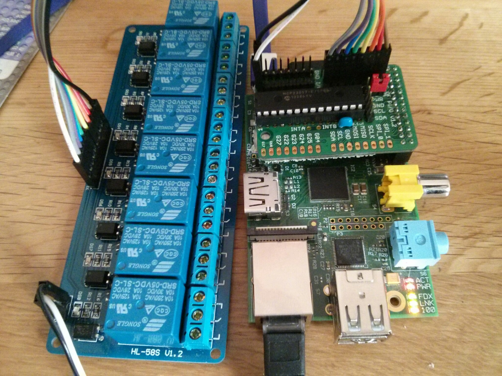
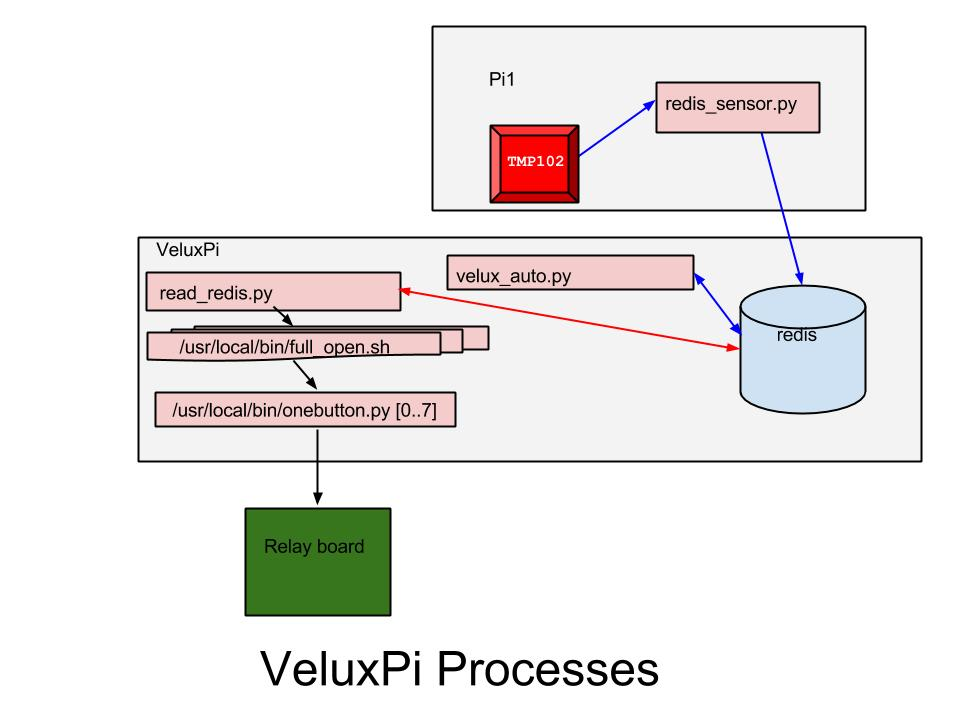

velpi
=====

Control Sainsmart 8 relay board using an MCP23017

For this particular board, it's very easy to use Ciseco's Slice of PI/O:
http://shop.ciseco.co.uk/k002-slice-of-pi-o/

Copy Shell and Python scripts to /usr/local/bin/

    chmod a+x *.sh
    chmod a+x *.py
    sudo cp *.sh /usr/local/bin/
    sudo cp one_button.py /usr/local/bin/

